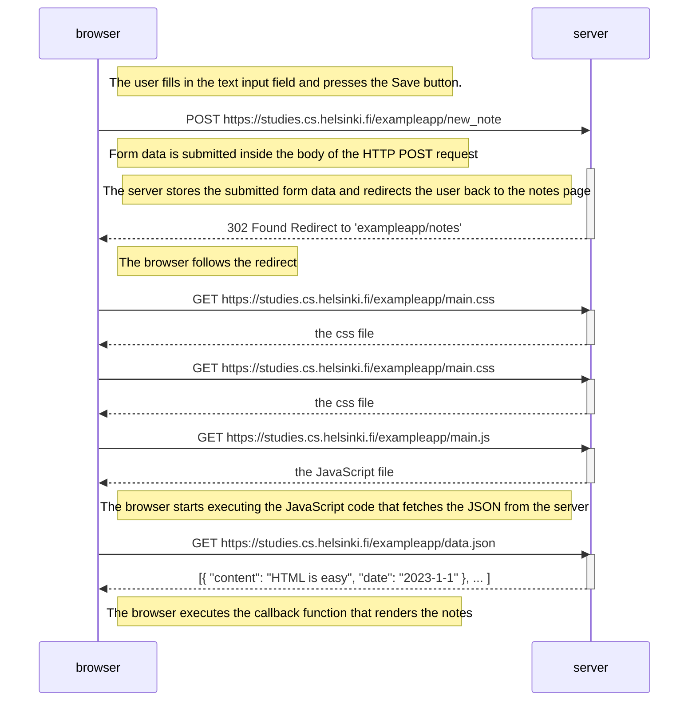

# Diagrams

## 0.4 New note diagram

> Create a similar diagram depicting the situation where the user creates a new note on the page https://studies.cs.helsinki.fi/exampleapp/notes by writing something into the text field and clicking the submit button.
>
>If necessary, show operations on the browser or on the server as comments on the diagram.



## 05 Single page app diagram

> Create a diagram depicting the situation where the user goes to the single-page app version of the notes app at https://studies.cs.helsinki.fi/exampleapp/spa

```mermaid
sequenceDiagram
    participant browser
    participant server

    browser->>server: GET https://studies.cs.helsinki.fi/exampleapp/spa
    activate server
    server-->>browser: HTML document
    deactivate server

    browser->>server: GET https://studies.cs.helsinki.fi/exampleapp/main.css
    activate server
    server-->>browser: the css file
    deactivate server

    browser->>server: GET https://studies.cs.helsinki.fi/exampleapp/spa.js
    activate server
    server-->>browser: the JavaScript file
    deactivate server

    Note right of browser: The browser starts executing the JavaScript code that fetches the JSON from the server

    browser->>server: GET https://studies.cs.helsinki.fi/exampleapp/data.json
    activate server
    server-->>browser: [{ "content": "HTML is easy", "date": "2023-1-1" }, ... ]
    deactivate server

    Note right of browser: The browser executes the callback function that renders the notes
````

## 06 Single page new note diagram

> Create a diagram depicting the situation where the user creates a new note using the single-page version of the app.

```mermaid
sequenceDiagram
    participant browser
    participant server

    Note right of browser: The user fills in the text input field and presses the Save button.
    Note right of browser: JS: The form submit default behaviour is prevented
    Note right of browser: JS: The new note is added to the local notes array
    Note right of browser: JS: The notes array is redrawn in the browser to reflect the new note
    Note right of browser: JS: The new note is POSTed as JSON to the server:
    browser->>server: POST https://studies.cs.helsinki.fi/exampleapp/new_note_spa
    activate server
    Note left of server: The server stores the submitted form data
    server-->>browser: 201 Created 
    deactivate server

```